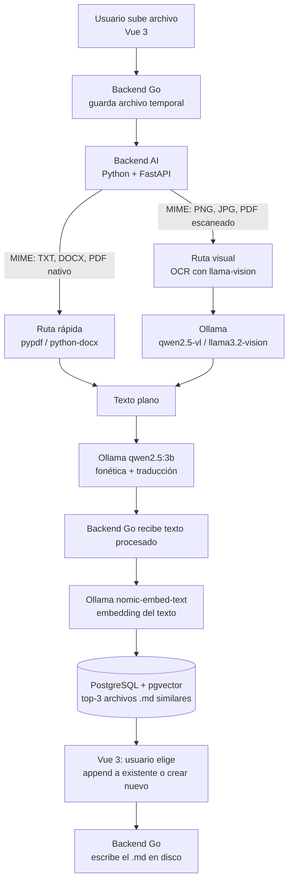

# LingoDoc System: AI-Powered English Learning & Parsing

> 📦 **100% local y privado.** Todos los modelos de IA corren en tu máquina con [Ollama](https://ollama.com). Tu información nunca sale de tu equipo.

LingoDoc es una aplicación web para el aprendizaje del inglés. Sube documentos (texto plano, Word, PDF) o imágenes (fotos, documentos escaneados, texto escrito a mano) y el sistema:

- Extrae el texto (OCR con visión artificial cuando es necesario).
- Genera una **aproximación fonética** "leída en español".
- (Opcional) Añade la **traducción al español**.
- Guarda el resultado en archivos `.md`, usando **búsqueda semántica (embeddings)** para sugerir si hacer *append* a un archivo existente o crear uno nuevo, todo accesible desde un catálogo web.

---

## 🛠 Stack Tecnológico

Arquitectura de microservicios, optimizada para despliegues *on-premise* con recursos limitados.

| Capa | Tecnología | Rol |
|---|---|---|
| Frontend | Vue 3 (Composition API, Vite) | Drag & drop de archivos, toggle de traducción, visor de Markdown del catálogo, selección de coincidencias semánticas |
| Backend Core | Go | API principal, concurrencia de subidas, orquestación de llamadas a IA, acceso a base de datos, escritura de archivos `.md` |
| Backend AI | Python + FastAPI | Detección y enrutamiento de tipo de archivo (extracción tradicional vs. visión artificial), comunicación con el motor LLM |
| Base de Datos Vectorial | PostgreSQL + pgvector | Almacenamiento y búsqueda de embeddings de los archivos `.md` |
| Motor LLM | Ollama | Ejecución local de modelos de texto, visión y embeddings |

## 🧠 Motor LLM

**Decisión del stack: Ollama.** Se evaluó `llama.cpp` (el motor base, mínimo consumo pero difícil de orquestar para intercambiar entre modelos de visión y texto) y Ollama, que usa llama.cpp por debajo y añade una API REST nativa y gestión automática de memoria (carga/descarga de modelos según demanda). El análisis completo está en [`docs/adr/001-motor-llm.md`](docs/adr/001-motor-llm.md).

### Modelos abiertos y ligeros (cuantizados en GGUF 4-bit)

| Modelo | Uso | RAM aproximada |
|---|---|---|
| `qwen2.5:3b` | Texto y formato | ~3 GB |
| `qwen2.5-vl:3b` / `llama3.2-vision:11b` | OCR / escritura a mano (ver nota) | ~2–8 GB |
| `nomic-embed-text` | Embeddings para búsqueda semántica | <1 GB |

> ⚠️ **Nota sobre RAM:** ejecutar los 3 modelos a la vez (~12 GB con el modelo `:11b` de visión) excede los 16 GB recomendados si el sistema también reserva memoria. Configura `OLLAMA_KEEP_ALIVE` para descargar modelos inactivos, o usa la variante de visión `:3b` en equipos con menos memoria.

---

## ⚙️ Arquitectura: Flujo de Datos (Pipeline)



### Fase 1: Recepción y Enrutamiento (Go → Python)

1. El usuario sube el archivo desde Vue 3 al endpoint de Go.
2. Go lo guarda temporalmente y lo envía al microservicio de Python.
3. Python evalúa el MIME type:
   - **Ruta rápida** (TXT, DOCX, PDF con capa de texto): extracción con `pypdf` / `python-docx`.
   - **Ruta visual** (PNG, JPG, PDF escaneado): si un PDF no devuelve texto con la ruta rápida, se rasteriza y envía a Ollama (`llama3.2-vision`).

### Fase 2: Procesamiento (Python → Ollama)

Python llama a Ollama (`qwen2.5:3b`) con este System Prompt:

```
Eres un asistente bilingüe. Tu tarea es extraer o formatear el texto en
inglés proporcionado, generar su traducción al español (si se requiere) y
crear una aproximación fonética usando las reglas de lectura del idioma
español.

Formato requerido:
([pronunciación leída en español])
[Texto en inglés] | [Traducción al español]
```

### Fase 3: Búsqueda Semántica y Guardado (Go → PostgreSQL)

1. Go solicita a Ollama (`nomic-embed-text`) el embedding del texto procesado.
2. Go consulta PostgreSQL (pgvector) buscando los **3 archivos `.md` más similares**.
3. Vue 3 muestra las coincidencias y el usuario elige: **append** a una coincidencia (ej. `notas_clase.md`) o **crear un archivo nuevo**.
4. Go escribe el archivo en disco.

---

## 📝 Ejemplo de Salida

Entrada: imagen con el texto `"I am Carlos and live in Bogota"`, con el flag de traducción activo. El texto inyectado en el Markdown será:

```
(iai am Carlos an. lif bogota)
I am Carlos and live in Bogota | Yo soy Carlos y vivo en Bogota
```

---

## 🚀 Requisitos de Infraestructura (Local)

| Componente | Requisito |
|---|---|
| CPU | Soporte AVX2 (Intel Gen 8+ / AMD Ryzen) o ARM (Apple Silicon M1/M2/M3) |
| RAM | 16 GB recomendados (≈8 GB reservados para Ollama) |
| Almacenamiento | SSD NVMe altamente recomendado (carga rápida / *hot-swapping* de los pesos de los modelos) |

## 🚦 Quick Start

```bash
# 1. Instalar y descargar los modelos en Ollama
ollama pull qwen2.5:3b
ollama pull nomic-embed-text
ollama pull llama3.2-vision:11b   # opcional: solo si procesarás imágenes/manuscritos

# 2. Levantar PostgreSQL con pgvector
docker compose up -d postgres

# 3. Arrancar los servicios
cd backend-ai && uvicorn main:app --reload
cd backend-core && go run ./cmd/server
cd frontend && npm run dev
```

> Los modelos de visión son ~8 GB de descarga. Si solo usarás TXT/DOCX/PDF, omítelo.

---

## 📂 Estructura del Proyecto

```
englissh-doc/
├── frontend/        # Vue 3 + Vite
├── backend-core/    # Go (API, orquestación, escritura de .md)
├── backend-ai/      # Python + FastAPI (extracción, llamadas a Ollama)
├── docs/adr/        # Decisiones arquitectónicas
└── docker-compose.yml
```

## 📚 Roadmap

- [ ] Umbral de similitud configurable para las coincidencias semánticas
- [ ] Re-vectorización incremental de archivos que crecen por append
- [ ] Exportación del catálogo
