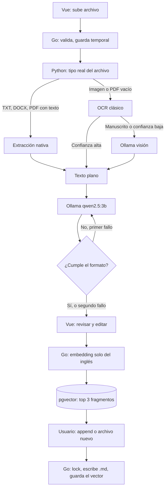

# LingoDoc

> 📦 **100% local y privado.** Los modelos corren en tu máquina con [Ollama](https://ollama.com). El texto de tus documentos no sale del equipo.
>
> **Estado:** especificación de diseño. En este repositorio todavía no hay código, `docker-compose.yml` ni el ADR enlazado en versiones anteriores. Los comandos de arranque de abajo son el objetivo, no algo que funcione hoy.

Aplicación web para aprender inglés a partir de material propio. Subes un documento o una imagen y LingoDoc:

1. Extrae el texto (librería nativa, OCR clásico o visión, según el archivo).
2. Genera una **aproximación fonética** leída con reglas del español.
3. (Opcional) Añade la **traducción al español**.
4. Te deja **revisar y corregir** el resultado antes de guardarlo.
5. Sugiere, por similitud semántica, si añadirlo a un `.md` existente o crear uno nuevo.

El catálogo de notas queda en archivos Markdown legibles en disco. La base vectorial solo indexa; no es la copia de lectura.

---

## Stack

Microservicios pensados para correr en local, con poca RAM.

| Capa | Tecnología | Rol |
|---|---|---|
| Frontend | Vue 3 (Composition API) + Vite | Subida, revisión del resultado, catálogo Markdown, elección de archivo destino |
| Backend core | Go | API, validación de subidas, orquestación, pgvector, escritura de `.md` |
| Backend AI | Python + FastAPI | Extracción de texto y llamada al LLM de formato |
| Índice | PostgreSQL + pgvector | Embeddings de cada fragmento, no del archivo entero |
| Modelos | Ollama | Texto, visión (solo si hace falta) y embeddings |

**Por qué Ollama y no llama.cpp directo.** llama.cpp gasta menos en reposo, pero intercambiar visión, texto y embeddings a mano implica scripts de carga y descarga. Ollama usa llama.cpp por debajo, expone una API REST y libera la RAM cuando el modelo no se usa. Para esta arquitectura eso pesa más que el proceso extra.

### Modelos

Cuantización GGUF 4-bit. El modelo de visión grande no es el predeterminado.

| Modelo | Uso | RAM aprox. | Cuándo |
|---|---|---|---|
| `qwen2.5:3b` | Traducción y formato | ~3 GB | Siempre |
| `nomic-embed-text` | Embeddings | <1 GB | Al confirmar el guardado |
| `qwen2.5-vl:3b` | OCR de manuscritos o OCR clásico de baja confianza | ~2–3 GB | Solo ruta visual difícil |
| `llama3.2-vision:11b` | Misma tarea, más calidad | ~8 GB | Opcional, máquina con margen de RAM |

No cargues los tres a la vez. Con 16 GB, `llama3.2-vision:11b` más el modelo de texto deja al sistema sin aire. Usa `OLLAMA_KEEP_ALIVE=0` (o unos segundos) para descargar el modelo al terminar la petición, y deja `:11b` como upgrade, no como default.

| Equipo | Configuración razonable |
|---|---|
| 8 GB | Solo TXT/DOCX/PDF con texto. Sin modelo de visión. |
| 16 GB | Texto + embeddings + visión `:3b`, con descarga automática entre fases. |
| 24 GB+ | Se puede usar `llama3.2-vision:11b` sin swap constante. |

---

## Decisiones de diseño

Estas reglas evitan los fallos típicos de este pipeline. Forman parte del diseño, no del roadmap.

**Extracción en tres escalones, no "visión para todo".**

1. TXT, DOCX y PDF con capa de texto: `pypdf` y `python-docx`. Un PDF se considera escaneado solo si la extracción nativa devuelve vacío (o casi vacío).
2. Imagen o PDF escaneado con texto impreso: OCR clásico (Tesseract o PaddleOCR). Es más rápido y no ocupa la RAM del modelo de visión.
3. Manuscrito, o OCR clásico por debajo de un umbral de confianza: recién ahí Ollama visión.

**El LLM no se persiste a ciegas.** La salida de `qwen2.5:3b` se valida con una expresión regular del contrato de abajo. Si no cumple, un reintento. Si vuelve a fallar, se muestra igual en la pantalla de revisión, marcada como no válida. El usuario edita antes de que exista embedding o escritura en disco.

**Se vectoriza el fragmento, no el archivo.** Cada bloque confirmado genera un embedding solo del inglés (sin fonética ni traducción: mezclar idiomas empeora la búsqueda). La similitud de un `.md` es la máxima entre sus fragmentos. Hacer append no deja vectores viejos: el fragmento nuevo se indexa solo. Umbral de similitud configurable; por debajo, no se sugiere append.

**Markdown es la fuente de lectura; Postgres es el índice.** Borrar o editar un `.md` a mano no actualiza pgvector. Un comando `reindex` reconstruye los embeddings desde los archivos. Escrituras concurrentes al mismo `.md` van con lock por archivo.

**La subida no confía en el cliente.** Nombre de archivo saneado (sin `..`, sin ruta absoluta), tamaño máximo, y tipo detectado por contenido, no solo por el header `Content-Type`.

---

## Pipeline



Documentos largos no se mandan de una pieza. Python parte por página o párrafo, Go informa progreso, y la revisión es por bloque. OCR más un modelo de 3B pueden tardar minutos en un PDF de muchas páginas; la UI no puede quedar en un spinner mudo.

### Fase 1 — Recepción (Vue → Go → Python)

1. Vue sube el archivo al endpoint de Go.
2. Go valida tamaño, nombre y tipo real, lo guarda en un temporal y lo reenvía a Python.
3. Python elige escalón de extracción (nativo, OCR clásico o visión).

### Fase 2 — Formato (Python → Ollama)

System prompt:

```text
Eres un asistente bilingüe. Recibes texto ya extraído. No inventes contenido
que no esté en el texto. No corrijas el inglés del usuario salvo erratas
evidentes de OCR, y si lo haces no cambies el sentido.

Para cada oración o párrafo, devuelve exactamente:

([pronunciación leída en español])
[Texto en inglés] | [Traducción al español]

Reglas:
- La fonética usa grafía española para que un hispanohablante la lea en voz alta.
  No uses IPA. No uses guiones bajos ni markdown.
- Conserva nombres propios y mayúsculas del inglés.
- La traducción va solo si el usuario la pidió. Si no la pidió, omite " | " y
  todo lo que iría después.
- Una oración por bloque. Separa bloques con una línea en blanco.
- Si un tramo no es inglés, déjalo como está y no lo traduzcas ni lo fonetices.
```

El flag de traducción viaja en la petición, no se infiere del prompt.

### Fase 3 — Confirmar y guardar (Vue → Go → Postgres)

1. Vue muestra el texto ya validado (o marcado como inválido) para editarlo.
2. Al confirmar, Go pide a `nomic-embed-text` el embedding **solo de la línea en inglés**.
3. pgvector devuelve hasta 3 archivos cuya mejor coincidencia supere el umbral.
4. El usuario elige append (por ejemplo `notas_clase.md`) o un nombre nuevo.
5. Go toma el lock del archivo, escribe el bloque y guarda el vector del fragmento.

---

## Contrato de salida

Entrada: `"I am Carlos and live in Bogota"`, con traducción activada.

```text
(ái am Cárlos and liv in Bogotá)
I am Carlos and live in Bogota | Yo soy Carlos y vivo en Bogotá
```

Sin traducción:

```text
(ái am Cárlos and liv in Bogotá)
I am Carlos and live in Bogota
```

Eso es el formato objetivo, no una captura de un modelo de 3B. Un modelo pequeño inventa fonética (`an.`, `lif`, guiones bajos). Por eso el guardado exige el contrato y una revisión humana. La calidad se mide con un set fijo de frases (inglés, fonética esperada, traducción) en el backend de IA, antes de cambiar el prompt o el modelo.

---

## Requisitos

| Componente | Requisito |
|---|---|
| CPU | AVX2 (Intel Gen 8+ / AMD Ryzen) o Apple Silicon |
| RAM | 16 GB para el flujo con visión ligera. 8 GB si no hay imágenes. 24 GB si se usa el modelo de visión de 11B |
| Disco | SSD. NVMe recomendado: Ollama carga y descarga pesos entre fases |
| Software | Ollama, Docker (solo Postgres), Go, Python 3.11+, Node.js |

GPU no es obligatoria. En Apple Silicon, Ollama usa Metal. En NVIDIA, CUDA. En CPU sola el flujo funciona, más lento.

---

## Arranque previsto

Cuando existan los servicios, el arranque es este. Hoy estos comandos fallan: no hay compose ni código.

```bash
# Modelos. El de visión 11B es opcional y pesa ~8 GB.
ollama pull qwen2.5:3b
ollama pull nomic-embed-text
ollama pull qwen2.5-vl:3b
# ollama pull llama3.2-vision:11b

# Índice vectorial
docker compose up -d postgres

# Tres terminales
cd backend-ai && uvicorn main:app --reload
cd backend-core && go run ./cmd/server
cd frontend && npm run dev
```

Variables que el diseño ya da por hechas:

| Variable | Uso |
|---|---|
| `OLLAMA_HOST` | URL de Ollama. Default `http://127.0.0.1:11434` |
| `OLLAMA_KEEP_ALIVE` | `0` en máquinas de 16 GB, para no retener el modelo de visión |
| `DATABASE_URL` | Postgres con pgvector |
| `CATALOG_DIR` | Directorio de los `.md`. Go rechaza rutas fuera de aquí |
| `MAX_UPLOAD_BYTES` | Tope de subida |
| `SIMILARITY_THRESHOLD` | Mínimo para sugerir append |

---

## Estructura prevista

```text
englissh-doc/
├── frontend/          # Vue 3 + Vite
├── backend-core/      # Go: API, lock de archivos, pgvector, reindex
├── backend-ai/        # FastAPI: extracción, prompt, testdata fonética
├── docs/adr/          # Decisiones que no caben en este README
└── docker-compose.yml # Postgres + pgvector
```

---

## Roadmap

Fuera del diseño anterior. Orden sugerido:

1. Set de pruebas de fonética y traducción, para no cambiar el prompt a ciegas.
2. Audio local con [Piper](https://github.com/rhasspy/piper) (CPU, sin GPU) en cada bloque.
3. Repaso espaciado generado desde los bloques ya guardados (inglés / traducción / fonética).
4. Exportar el catálogo.
5. Fonética determinista (`espeak-ng` o equivalente, mapeada a grafía española) si el set de pruebas demuestra que el 3B no es estable. El LLM se quedaría solo con la traducción.

## Decisiones abiertas

No cambian el stack documentado arriba. Conviene cerrarlas antes de escribir código.

| Tema | Opción documentada | Alternativa |
|---|---|---|
| Backends | Go orquesta y Python extrae | Un solo backend Python. Menos procesos; Go no es el cuello de botella (lo es el modelo) |
| Fonética | Prompt sobre `qwen2.5:3b`, con validación y revisión | Librería determinista, y el LLM solo traduce |

## Fuera de alcance (por ahora)

- Cuentas, multiusuario y sync entre máquinas.
- Corregir gramática inglesa del texto original. Se conserva lo que el usuario subió.
- Enviar documentos a APIs de pago. Si un modelo no corre en Ollama, no entra.